# RAG with Apache Airflow, LlamaIndex, and Qdrant

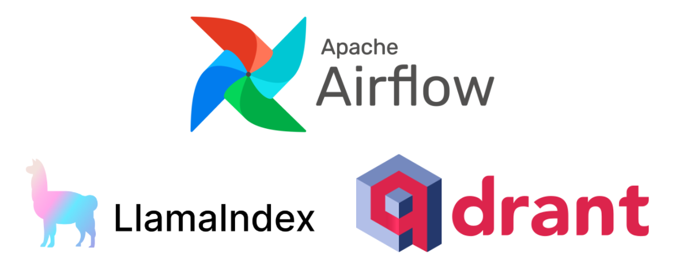

## Overview

Welcome to this repository! The purpose of this project is to demonstrate how to implement Retrieval-Augmented Generation (RAG) using Apache Airflow for orchestration, LlamaIndex for document indexing, and Qdrant for vector search. For a complete explanation, please check out my Medium article about this project [here](https://medium.com/@sheltoncarr/rag-with-apache-airflow-llamaindex-and-qdrant-d6077c6e0e7f)!

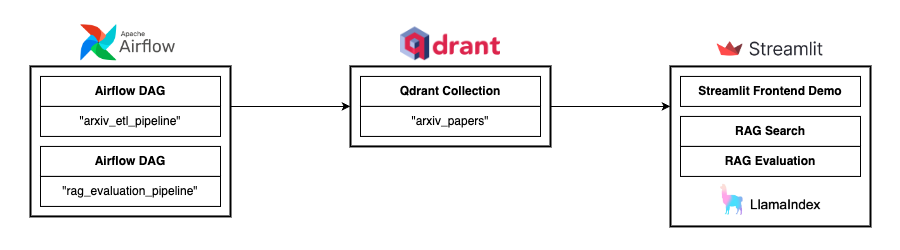

To keep things simple, this project utilizes a free Qdrant Cloud cluster, Airflow running locally with Docker, and a local Streamlit frontend for demonstrations.

The RAG system uses hybrid search (dense and sparse embeddings) and re-ranking for retrieval. The system also comes with a fully automated RAG response evaluation pipeline.

This project has two Airflow DAGs (Directed Acyclic Graphs): 

1. `airflow/dags/arxiv_etl_pipeline.py`: An ETL pipeline that will pull the latest machine learning research papers from arXiv, chunk them, embed them, and upload them to Qdrant. The document processing is handled by LlamaIndex using a Document object.
2. `airflow/dags/rag_evaluation_pipeline.py`: An automated RAG response evaluation pipeline that generates questions based on the Qdrant knowledge base, answers those questions using the RAG system, and then uses an evaluation LLM to score the responses based on faithfulness and relevancy to the generated questions. Finally, the DAG will return summary metrics of the RAG system’s performance.

In a production setting, these DAGs can be ran on a custom schedule to maintain a current Qdrant knowledge base and a fully automated RAG response evaluation pipeline for production monitoring. These pipelines can be modified to accommodate other data sources and evaluation metrics as well, based on your specific use case.

To demo the project, I set up a simple Streamlit frontend that can use our RAG system to answer questions about the knowledge base created in Qdrant. It can also demonstrate the automated evaluation pipeline at the click of a button.

## Running This Repository Locally

Requirements to run locally: PostgreSQL, Airflow, Docker, Qdrant Cloud Cluster, Qdrant API Key, and an OpenAI API Key

You can get started with Airflow locally by following these steps in the official documentation: https://airflow.apache.org/docs/apache-airflow/stable/start.html

To set up a PostgreSQL database with Airflow, check out the official Airflow documentation: https://airflow.apache.org/docs/apache-airflow/stable/howto/set-up-database.html#setting-up-a-postgresql-database

You can get a free Qdrant Cloud cluster by following these steps in the official documentation: https://qdrant.tech/documentation/quickstart-cloud/

Once you have the above requirements set up, you can run this project locally by first git cloning this repository and pip installing the `requirements.txt` file located in the root of the repository (there's a separate `requirements.txt` file in the `airflow` folder for running the Airflow DAGs using Docker). Then, create a `.env` file in the root of the repository using the provided `.env_example.txt` file as a guide. Optionally, you can create an additional `.env` file in the `airflow` folder using the `.env_example.txt` in the `airflow` folder as a guide. This `.env` file silences a docker-compose warning that can be safely ignored. See [here](https://airflow.apache.org/docs/apache-airflow/stable/howto/docker-compose/index.html#setting-the-right-airflow-user) for details.

To launch Docker using the `docker-compose.yaml` file, navigate to the `airflow` folder in the terminal and run the the following command:

`docker compose up --build`

It will take about one minute for all the processes to initialize. To check on the status, you can run the `docker ps` command in another terminal tab.

Once all processes are up and running, go to http://localhost:8080 to view the local Airflow GUI.

For the login page, use the following credentials:

- Username: airflow
- Password: airflow

Before we can use our DAGs, we need to input the relevant variables and connections in our Airflow GUI.

Go to Admin → Variables, and add a new variable with the following fields:

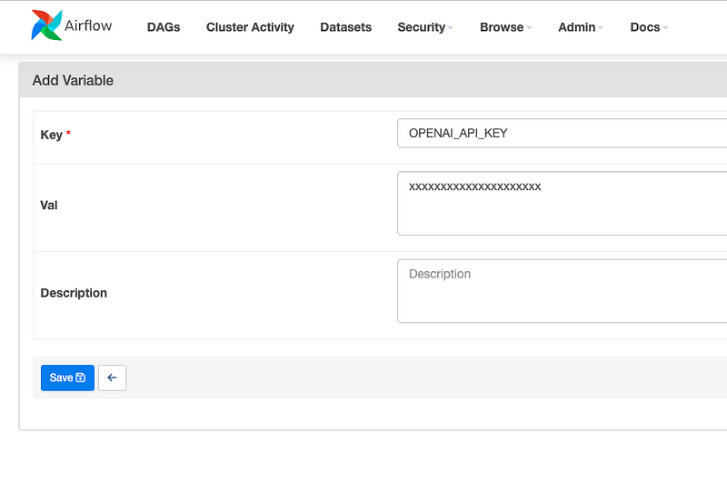

For "Val", substitute the field with your OpenAI API key.

Go to Admin → Connections, and add a new connection with the following fields:

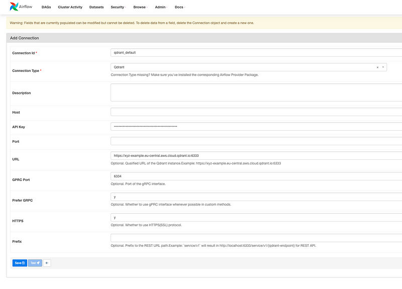

For "API Key" and "URL", substitute the field with your Qdrant API Key and Qdrant instance URL.

Let's test the `arxiv_etl_pipeline` DAG! To run the DAG, simply click on the DAG on the homepage and then click the DAG trigger:

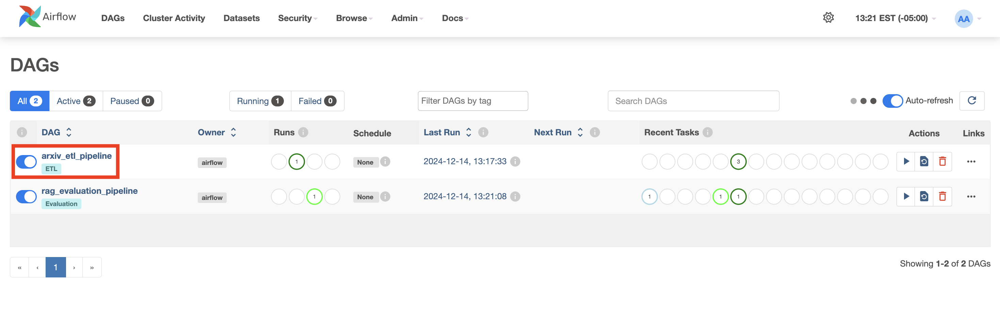

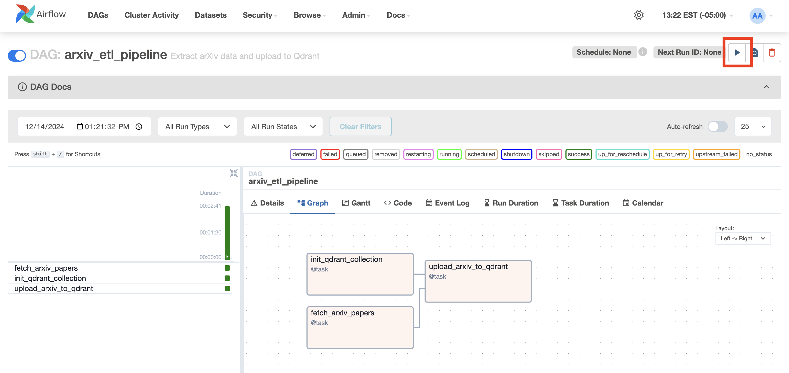

You can monitor the progress of the DAG by looking at the Logs tab, which will log key information. Or you can see the status of each task in the visual on the left-hand side:

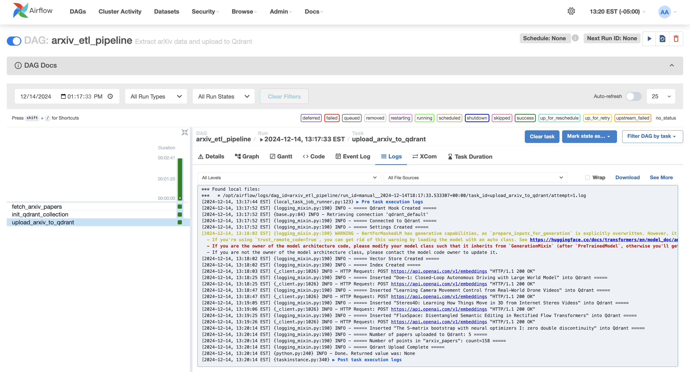

Once the `arxiv_etl_pipeline` DAG is finished running, you can check that it worked by going to your Qdrant cluster dashboard. Here you should see that a collection has been created with points inserted for our indexed document chunks:

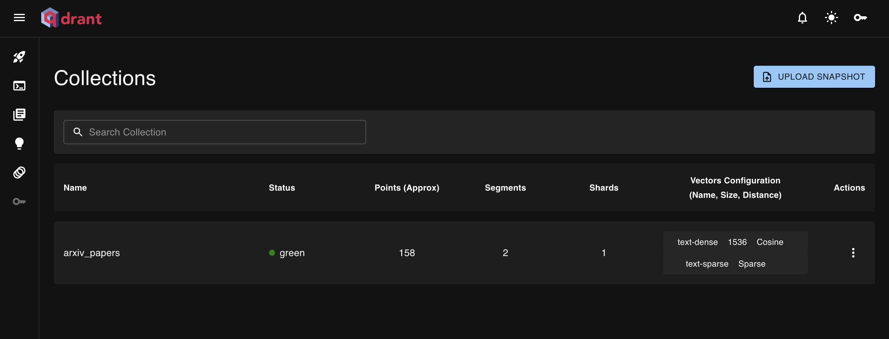

Now, try running the `rag_evaluation_pipeline` DAG for a fully automated RAG evaluation pipeline!

You can run the Streamlit app to demo the RAG system by running this command in the terminal in the root of the repository:

`streamlit run streamlit_app.py`

This should automatically open a browser tab, with the option to navigate between the two pages of the Streamlit app:

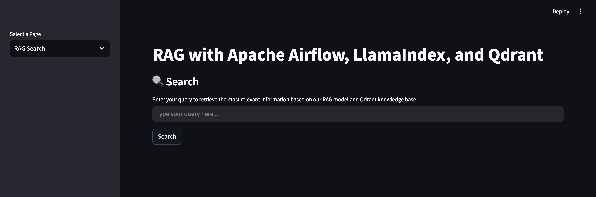

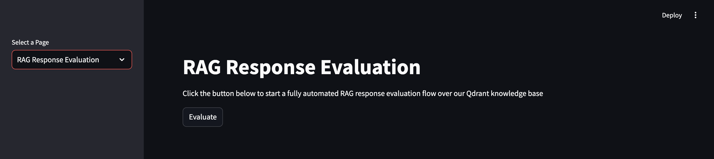

To demo the RAG system, try searching a query or clicking the Evaluate button! Here are some example responses for RAG Search and RAG Response Evaluation:

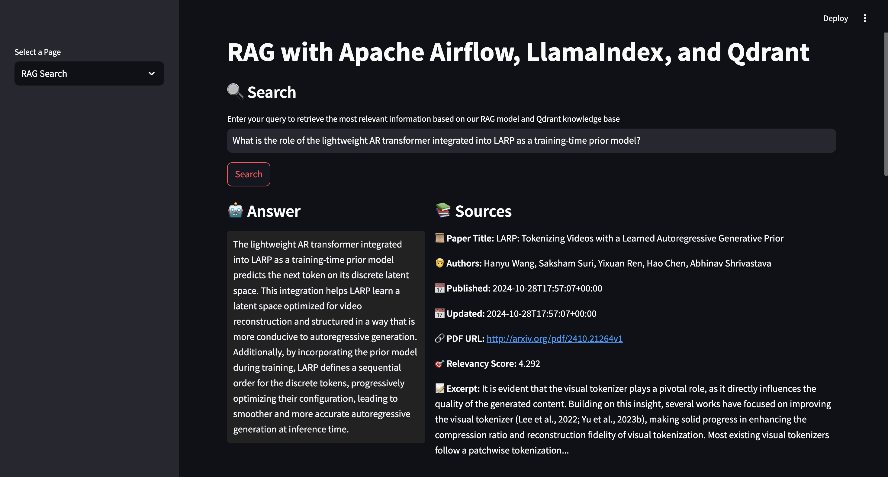

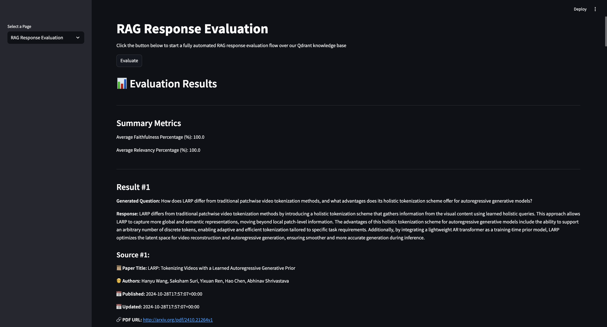

Once you are finished, be sure to clean up your workspace by following these steps:

- To end the Streamlit session, press `Control + C` in the terminal

- To end the Docker session, press `Control + C` in the terminal to gracefully shut down any running processes, and then run the following command to clean up Docker:

    `docker compose down --volumes --rmi all`

Please check out my Medium article about this project [here](https://medium.com/@sheltoncarr/rag-with-apache-airflow-llamaindex-and-qdrant-d6077c6e0e7f) for more details!